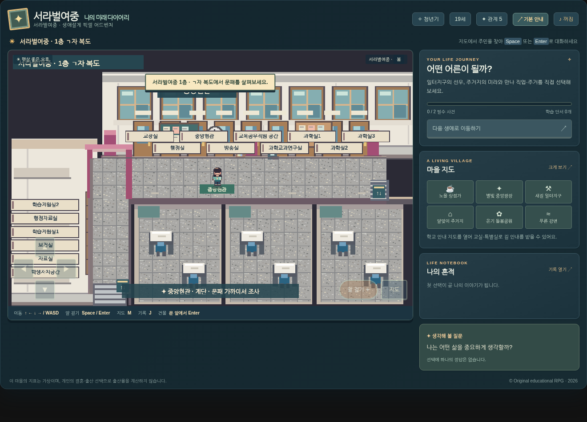

# 📔 서라벌여중: 나의 미래 다이어리
**기존 《세월항: 내일을 잇는 마을》을 기반으로 한 픽셀 RPG 리뉴얼 버전**

첨부된 실제 학교 외관 사진의 **붉은 벽돌 4층 본관·긴 창문 행렬·출입구 캐노피·녹색 철제 정문**을 참고하여 오리지널 픽셀 PNG 에셋을 제작하고 게임에 실제 연결했습니다. 1~4층 학교와 17개 학급 담임, 학교/마을 실내 탐험, 3단계 길 안내, 건물별 조사 기록을 기존 코드에 추가했습니다. 새 게임은 학교 입구에서 시작하며, 기존 생애설계 미션과 저장 호환성은 유지됩니다.

**추가 구현·검증 범위 및 한계:** [리뉴얼 적용 및 검증 보고서](docs/리뉴얼_적용_및_검증.md). 교실의 실제 위치를 보여 주는 도면이 제공되지 않아 **층별 배치는 게임용 축약 구성**입니다. 모든 추가 기능이 완성된 상업 게임 수준이라고 주장하지 않습니다.



---

## 최신 업데이트: ㄱ자형 학교 복도 및 전체 공간명 표시 (2026-10-10)

이 버전은 기존 17개 학급과 마을·생애설계·저장 코드를 보존하면서 **1~4층 ㄱ자형 실제 통행 복도**, 54개 등록 공간, 문패 근접 시 전체 이름 표시, 54개 방 출입구에 대한 길 안내, 층별 위치 안내도를 추가한 개발용 리뉴얼입니다. 학교 밖 간판에도 **서라벌여중** 명칭을 적용했습니다.

**건축 정확도 주의:** 실제 교실배치도 원본과 실측 자료가 이번 파일 묶음에 없어, 방별 정확한 위치와 교실 내부 구조는 검증되지 않은 게임용 재구성입니다. 학교 그래픽은 직접 생성한 1차 픽셀 에셋이며, 원래 목표한 고밀도 타일·전실 독립 미니게임 수준의 전면 제작은 아직 남아 있습니다. 22개 Python 테스트와 Chromium 스모크는 통과했지만 **Streamlit 서버, Google Sheets 실제 쓰기, 물리 기기 테스트는 미실시**입니다.

변경 내역과 검증 범위: **[ㄱ자형 학교 리뉴얼 보고서](docs/ㄱ자형_학교_리뉴얼_검증보고서.md)**. 실제 구동 스크린샷은 `docs/학교_1층_ㄱ자복도.png` ~ `학교_4층_ㄱ자복도.png`를 확인하세요.

---


## 빠른 실행

Python 3.11 이상에서:

```bash
pip install -r requirements.txt
streamlit run app.py
```

Streamlit이 출력하는 localhost 주소에서 학생 코드(예: `3-2`), 번호(예: `07`), 닉네임, 8자리 이상의 이어하기 암호를 입력합니다. **구글 인증정보가 없어도 개발용 SQLite 저장 모드**로 실행됩니다. 실제 다수 학생이 사용할 때는 반드시 Google Sheets 연결 및 기기 검증이 필요합니다.

## 현재 구현 범위

- 제공 사진 기반 서라벌여중 오리지널 외관 PNG 및 실제 게임 렌더링, 학교 정문 시작
- 학교 1~4층 ㄱ자형 복도와 54개 등록 공간, 17개 교실 담임 교사, 교실 5개/특별실 3개 조사 기록
- 구분되는 실내 배경 PNG 13종과 마을 건물 3개 조사 기록, BFS 경로 안내
- 6개 연결된 마을 구역(노을 상점가, 별빛 중앙광장, 새길 일터지구, 달맞이 주거지, 온기 돌봄공원, 푸른 강변)
- 직접 그리는 오리지널 픽셀 풍경과 4방향 캐릭터 이동·2프레임 걷기·NPC 외형 조합, 계절 연출
- NPC와의 근접 상호작용, 건물 출입과 독립된 소규모 실내 화면, 키보드/태블릿 터치 방향키/상호작용
- 청년기→성인기→노년기, 청년기 직업·주거 선택, 성인기 돌봄·사회적 대응, 노년기 재무·건강·여가·대인 관계
- 16개 사건 중 각 시기 필수 이벤트(2+2+4)를 **순서와 무관하게** 방문 가능; 지도 빠른 이동과 선택 탐험
- 정책 선택에 따른 일부 건물 간판, 휴식 공간, 장터 장식 변화
- 짧은 하루 일정 조율 미니게임(부가 체험; 엔진 학습 기록과 점수에 영향 없음)
- Python 이벤트 검증 및 중복 전송 방지(이벤트 nonce, 기록 revision), 사건 중심 저장/복원
- Google Sheets의 **`sewol_port_v1` 단독 시트**로 append-only 저장, 로컬 SQLite 대체 모드
- 비밀번호 해시(PBKDF2), 수업 종료 후 소감 작성, 교사용 인증 대시보드/CSV

## 조작법

| 동작 | 데스크톱 | 태블릿 |
|---|---|---|
| 이동 | 화살표 또는 WASD (계속 누름) | 화면 왼쪽 방향패드 (계속 누름) |
| 대화, 건물 입장 | 주민·문 근처에서 Enter/Space | 화면 오른쪽 **말 걸기** |
| 마을 지도 | M | **지도** 버튼 또는 오른쪽 구역 버튼 |
| 나의 기록 | J | 오른쪽 **기록 열기** |
| 다음 생애 | 해당 시기의 필수 사건을 마치고 오른쪽 버튼 | 동일 |
| 건물 나가기 | 실내 출구(아래쪽)로 이동, 학교는 정문/계단 조사 | 동일 |
| 학교 안내도 | 학교 안에서 M | 학교 안에서 **지도** 터치 |
| 길 안내 모드 | 상단 **길 안내** 버튼 | 상단 **길 안내** 버튼 |

진행 속도가 느리면 각 시기의 오른쪽 **필수 주민 안내**를 참고한 뒤 지도로 구역을 선택하면 됩니다. 게임의 기본 진행은 **직업+주거 → 돌봄+정책 → 노후 준비 4개 → 엔딩**입니다. 나머지는 자유롭게 경험할 수 있습니다. 엔딩 후에도 지도를 돌아다니고, 아직 선택하지 않은 세대협력·축제·정원 사건을 이어서 플레이할 수 있습니다.

## Google Sheets 연결 (실제 수업 전)

1. Google Cloud에서 Sheets API를 활성화하고 서비스 계정 JSON을 발급받습니다.
2. 새 구글 스프레드시트를 만들고 서비스 계정의 `client_email`을 **편집자**로 공유합니다.
3. `.streamlit/secrets.toml.example`을 참고해 `.streamlit/secrets.toml`에 `sheet_id`, `teacher_password`, `[gcp_service_account]`를 설정합니다. **비밀키는 GitHub에 업로드하지 마세요.**
4. 실행 시 `sewol_port_v1` 시트가 생성됩니다. `event_id,saved_at,class_code,student_id,nickname,run_id,revision,state_json` 헤더를 자동 사용합니다.
5. 학생은 사건 선택·생애 전환·소감문 저장 시에만 시트에 기록합니다. 교사용 화면은 `https://APP_URL/?mode=teacher` 또는 실행 URL 끝에 `?mode=teacher`로 입장합니다.

**중요**: Sheets의 append API는 원자적 동시 업데이트를 보장하지 않으므로, 같은 학생번호로 여러 기기에서 동시에 플레이하면 복원 순서가 섞일 수 있습니다. 수업은 한 학생 한 기기, 반·번호 고유하게 사용하세요. 시트 API 장애에 대비해 각 학생은 왼쪽의 **JSON 내려받기**를 활용할 수 있습니다. SQLite는 Streamlit Cloud 재시작 시 영구 저장을 보장하지 않습니다.

## Streamlit Cloud 배포

1. 이 폴더의 파일을 **새 저장소**에 업로드합니다(`app.py`를 루트에 둠). 기존 `game2` 저장소와 Google 시트는 그대로 둡니다.
2. Streamlit Community Cloud에서 GitHub 저장소를 연결하고 진입 파일을 `app.py`로 설정합니다.
3. 앱 관리 화면 Secrets에 `.streamlit/secrets.toml.example` 예시를 실제 값으로 채웁니다.
4. **교사 테스트 계정**으로 로그인→두 사건 선택→화면 새로고침→이어하기→노년기→엔딩→교사 대시보드까지 검증합니다.
5. 실제 iPad Safari 및 Android Chrome에서 길게누름, 취소, 화면 회전, 온스크린 키보드, Sheets 쓰기 시간을 검증한 뒤 반 전체에 배포합니다.

## 개발과 검증

```bash
python -m unittest discover -s tests -v
python -m compileall -q app.py engine.py content.py storage.py
node --check frontend/game.js
```

수업용 매핑은 [`docs/교과서_학습목표_대응표.md`](docs/교과서_학습목표_대응표.md), 50분 예시는 [`docs/수업_운영안.md`](docs/수업_운영안.md)를 참고하세요.

## 의도적으로 미구현 또는 미검증된 범위

- 각각 고유 미니게임·실내 NPC 일정·완전히 서로 다른 실내 타일 구조 (건물 종류별 테마 PNG와 기록형 조사 3개는 구현됨)
- 손으로 제작된 고밀도 스프라이트 아틀라스와 컷신, NPC의 실제 일과 시간표 (현재 절차적 픽셀아트/2프레임 연출)
- 도보 외 미니게임의 점수·재화 정산, 실시간 복잡한 경제/물가 모델
- 정책이 발생시키는 전체 마을 경제·인구를 정량 추산하는 시뮬레이터 (정책별 일부 풍경·대사 변화만)
- 실제 20분 완료율, 교실 단위 Google Sheets 부하, iPad/Android 물리기기 실측
- 자동화된 픽셀 그래픽 스냅샷 회귀 테스트, 3종 브라우저의 원격 종단간 테스트

**교육 설계 원칙**: 이 게임은 출생률이나 인구 구조를 학생의 결혼/출산 여부로 변화시키지 않습니다. 교과서의 2015·2016·2018년 과거 통계·기사와 오늘의 현황을 구별하며, 수업 모형의 지표는 실제 국가 통계가 아닙니다. 학생의 삶에는 승패나 하나의 정답이 없습니다.

## 2026-10-10 실제 사진 기반 픽셀 그래픽 리뉴얼

사용자가 제공한 서라벌여중 외관·교실·복도 사진을 **색상, 재질, 건축적 형태**의 기준으로 반영했습니다. RPG 예시 이미지는 **선명한 타일, 3/4 탑다운 시점, 소품 밀도, 4방향 스프라이트**의 참고 자료로만 활용했습니다. 제공된 사진과 게임 참고 이미지의 픽셀·인물·완성 장면을 그대로 재사용하지 않았습니다.

- 사진 기준 학교 외관: 붉은 벽돌, 푸른 곡면 지붕, 왼쪽의 회색 연결 동, 흰 창틀, 운동장, 야외 차양.
- 복도: 밝은 테라조 바닥, 크림 벽, 목재 창틀, 진분홍 기둥·아치 장식 및 연결된 ㄱ자형 동선.
- 교실: 실제 사진에서 확인된 파란 플라스틱 의자, 금속 책상 프레임, 밝은 책상, 캐비닛, 롤 블라인드.
- 전체 게임: 13종 미래마을 건물 외관, 13종 실내 장면, 3종 나무, 6종 4방향 주인공 스프라이트, 17종 교사 스프라이트의 원본 PNG를 작성·교체.
- 기존 맵/퀘스트/Google Sheets/저장 키는 변경하지 않았습니다. 학교 복도 충돌 및 출입 좌표 데이터도 종전 ㄱ자형 버전을 유지합니다.

### 에셋을 다시 생성하는 방법

기존 기본 생성기 `tools/generate_school_assets.py`는 오래된 에셋으로 교체하고 매니페스트를 초기화하므로 **이번 최신 에셋을 다시 만들 때 실행하지 마세요.** 다음 순서로 실행합니다.

```bash
python tools/generate_photo_inspired_assets.py
python tools/generate_detailed_interiors.py
python tools/validate_assets.py
node --check frontend/game.js
python -m unittest discover -s tests -q
python tools/browser_smoke.py
```

이번 제작물은 정밀한 수작업 픽셀 리메이크의 완성판이 아니라 **사진 기준 구조와 색채를 반영한 실제 게임 적용용 1차 아트 패스**입니다. 실측 교실배치도·실제 기기·Google Sheets 자격정보가 없으므로 해당 항목은 검증하지 않았습니다. 픽셀 소품마다 독립 충돌 영역을 배정하는 작업과 모든 개별 교실의 실제 인테리어 일치 작업은 남아 있습니다. 세부 사항은 `docs/사진참고_에셋_개선_검증보고서.md`를 확인하세요.

## 2026-10-10 · 실제 학교 사진 참고 픽셀 아트 2차 개선

실제 서라벌여중 건물/교실/복도 사진과 유저가 제공한 픽셀 JRPG 참고 장면을 구분하여 적용했다. ㄱ자형 복도 4개 층, 교실, 11종 특별실 배경, 주인공 6종과 교사 17종 4방향 애니메이션 시트를 새로 생성했다. 복도 문패에는 기존 방 ID 번호뿐 아니라 전체 한글 이름을 출력하도록 개선했다. 이전 버전 미래마을 건물·실내 PNG 및 데이터는 유지했다.

완료/한계/테스트 결과는 [`docs/사진실물_픽셀아트_2차개선_검증.md`](docs/사진실물_픽셀아트_2차개선_검증.md)에 있다.

그래픽 재생성: `python tools/refine_school_pixel_art.py` 및 `python tools/refine_character_sprites.py` (Pillow 필요). 기존 저장 키와 Google Sheets 연동 코드는 보존했지만 실제 원격 연동, Streamlit 서버 및 물리 태블릿 검증은 이 환경에서 미실시했다.
